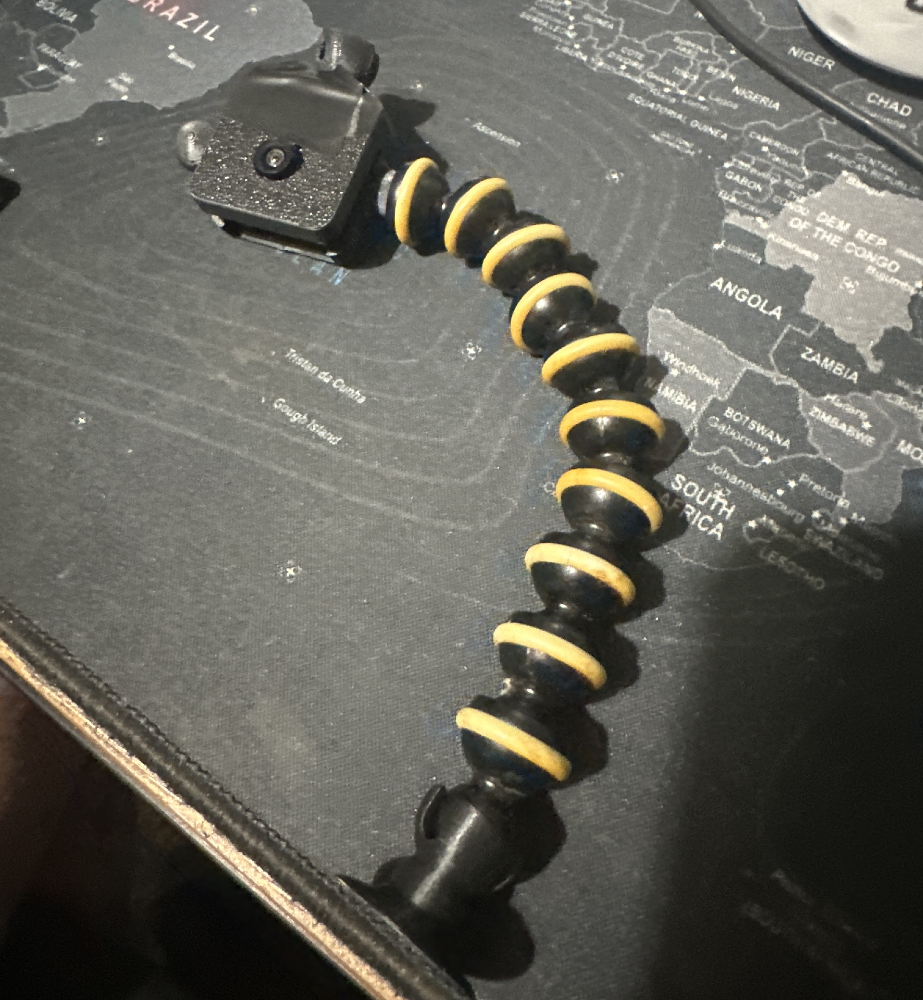
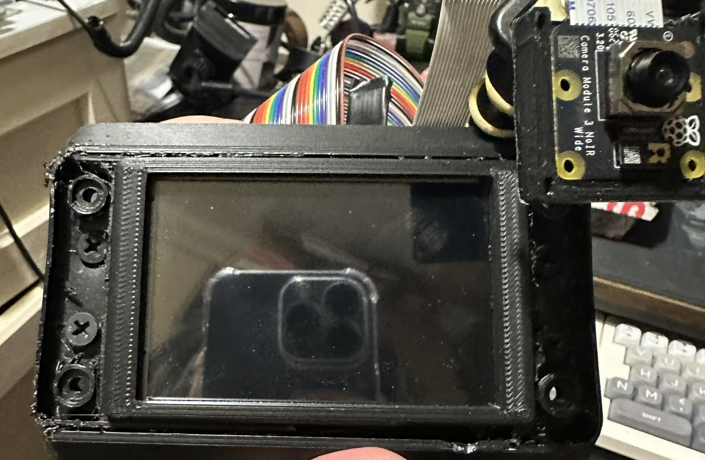
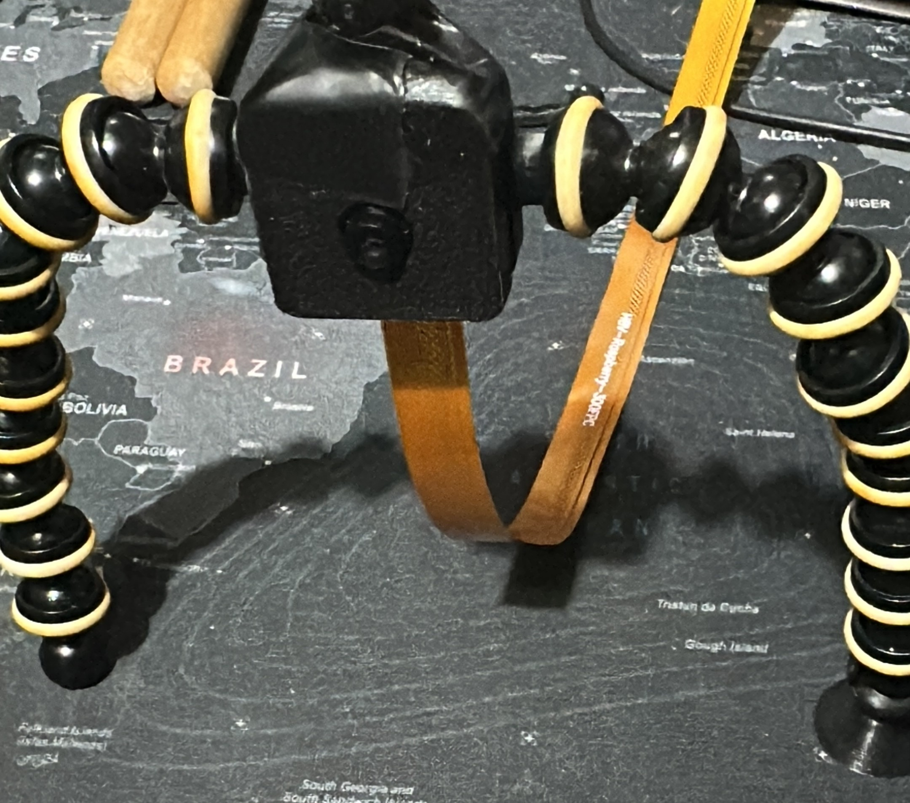
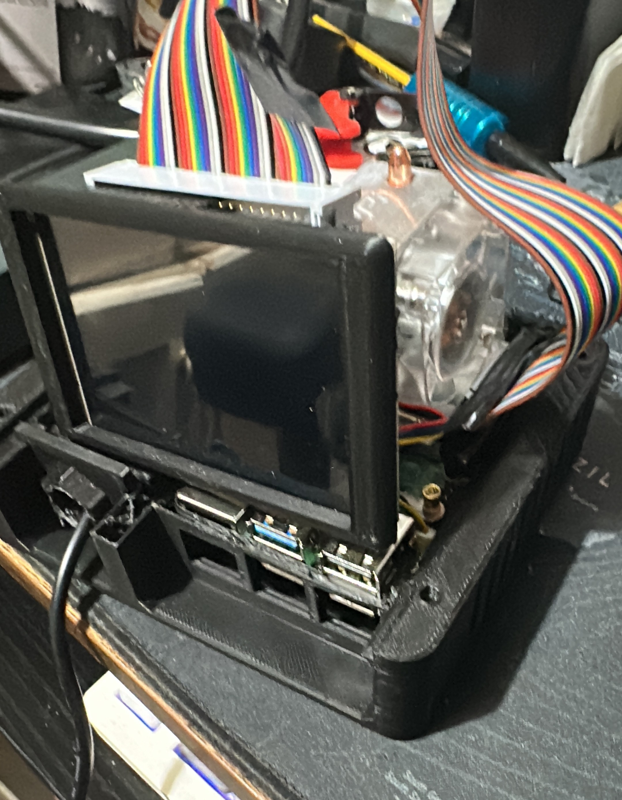
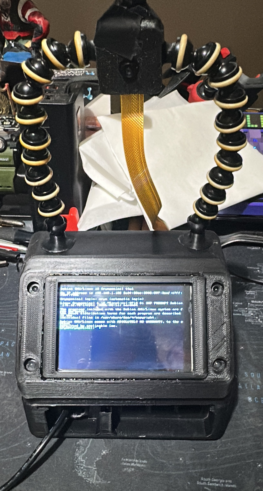
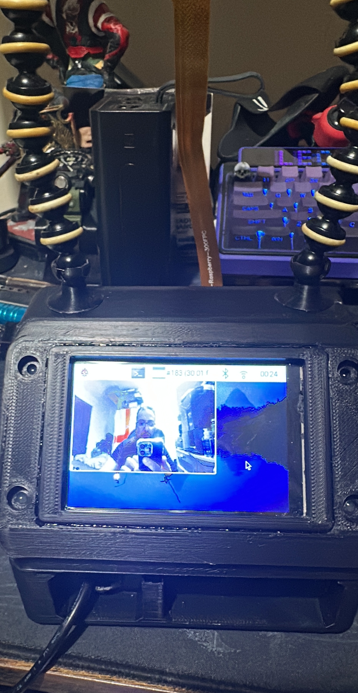

---

### AI Vision Assistant - Portable Raspberry Pi LLM Device (2025)

**Description**  
Portable Raspberry Pi-powered AI assistant running a local LLM. Equipped with a camera (Raspberry Pi Camera Module 3 NoIR) that allows the AI to see the environment and act as a visual assistant. Housed in a custom 3D-printed case and mounted on a GorillaPod for flexible use.

**Features**
- Raspberry Pi running local LLM
- AI Vision capabilities via Camera Module 3 NoIR
- Touchscreen display for interaction
- 3D-printed rugged portable enclosure
- Flexible GorillaPod tripod mounting
- Terminal and graphical interface visible

**Gallery**

**Notes**  
Prototype of a portable AI assistant with vision. The LLM uses the camera feed to understand surroundings and provide assistance. Still in development.
