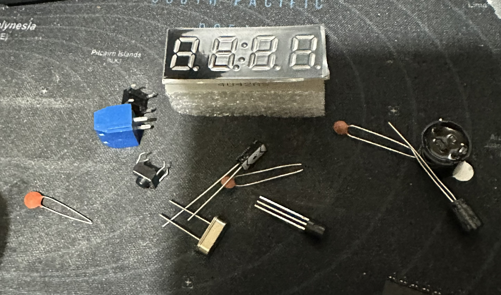
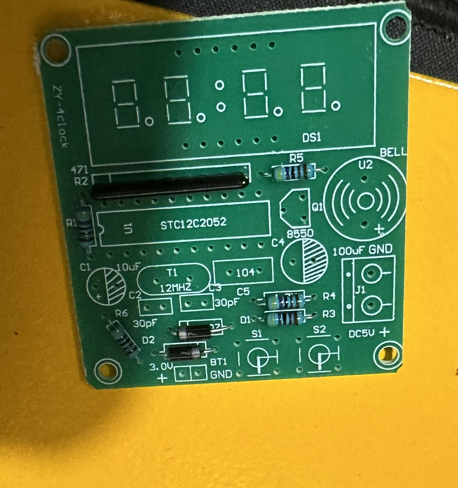
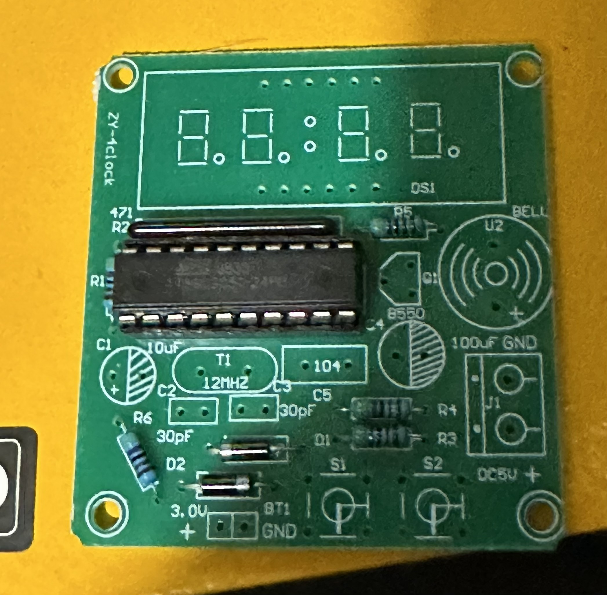
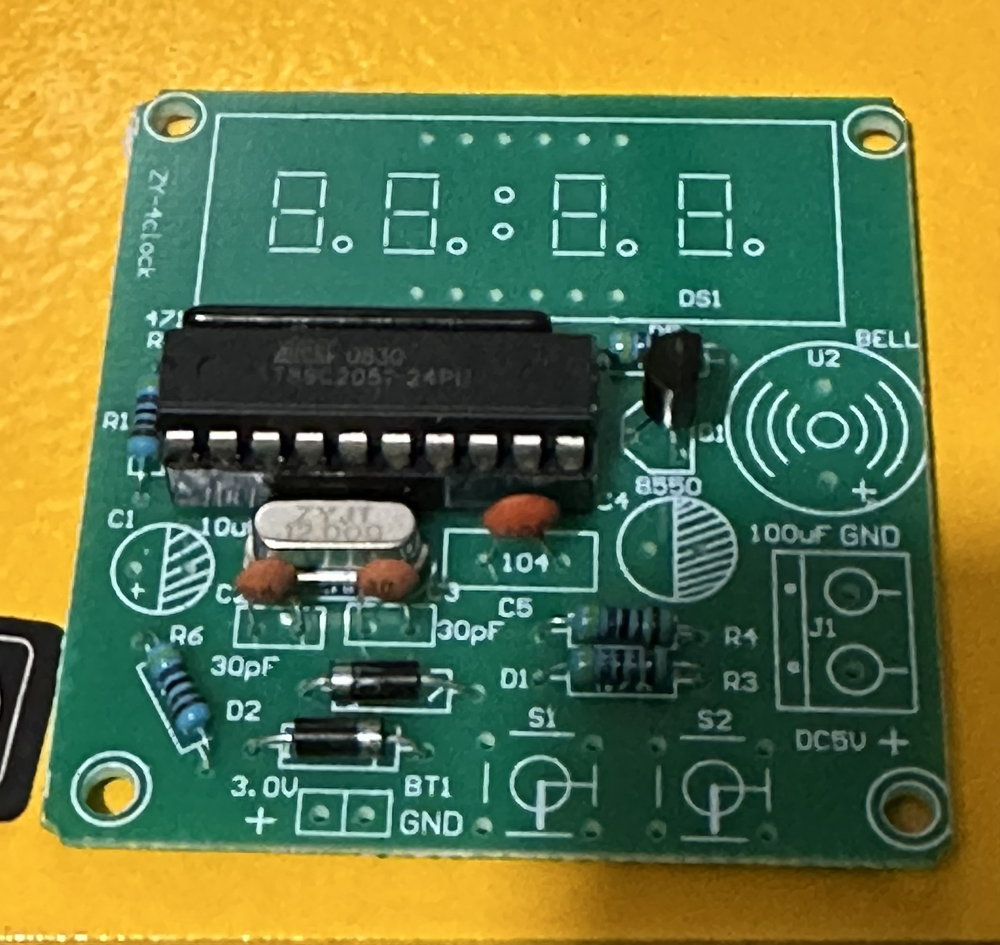
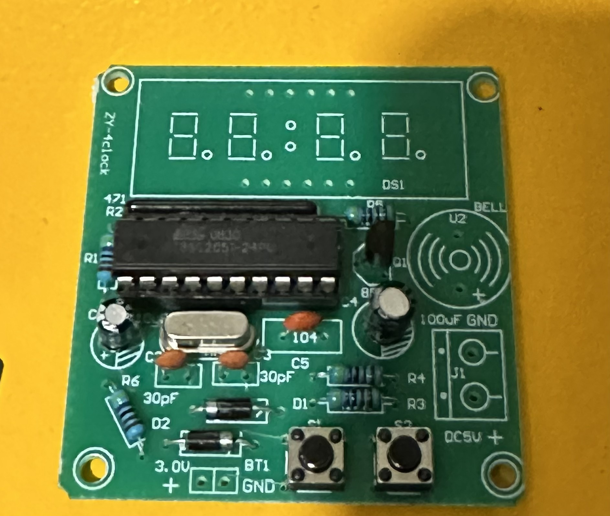
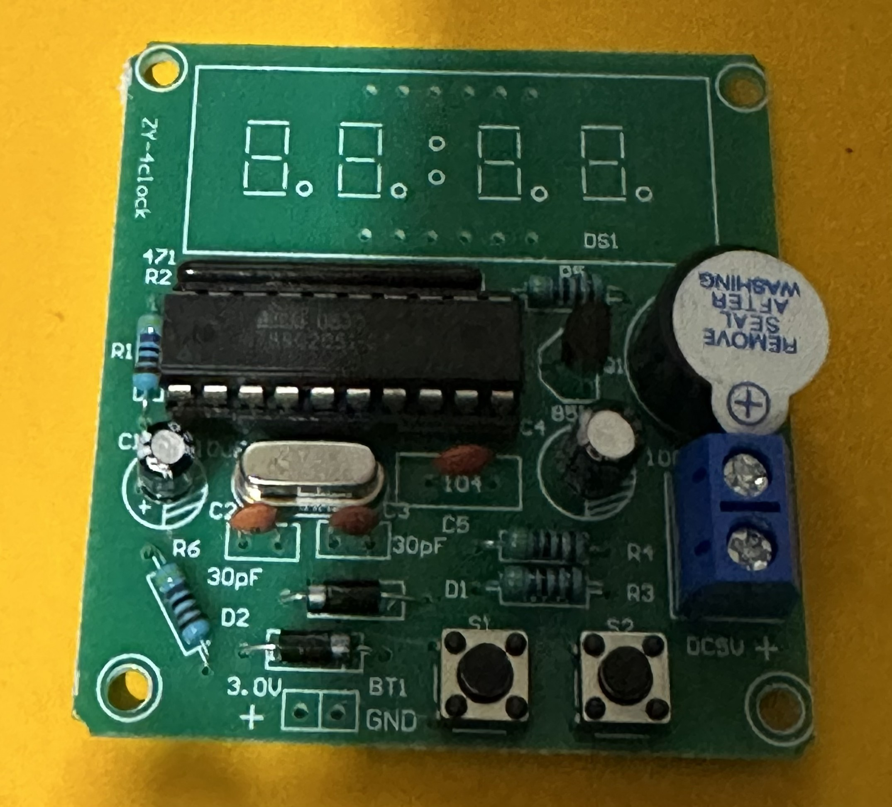
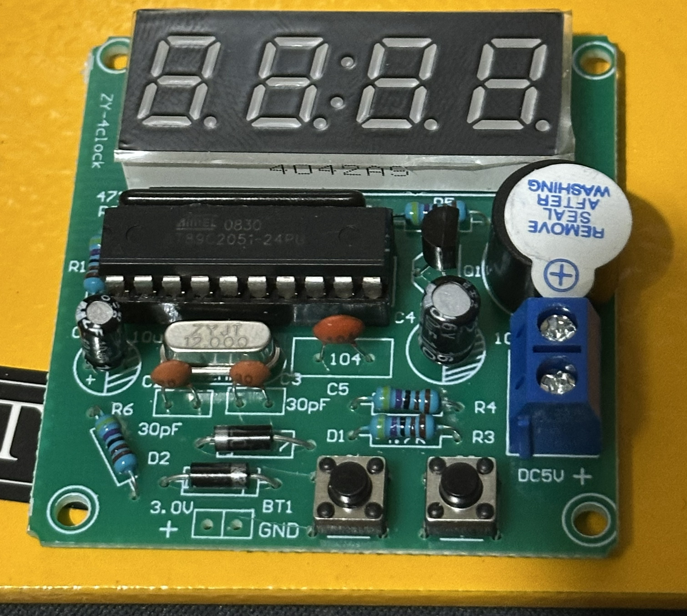
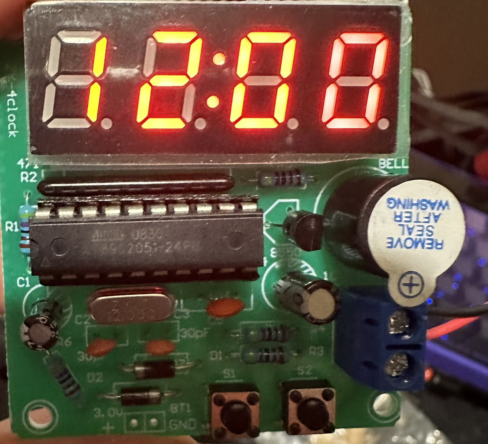

---

### Digital Alarm Clock Module (2025)

**Description**  
DIY digital clock and alarm project based on the STC12C2052 microcontroller. Features a 4-digit 7-segment display, piezoelectric buzzer for alarms, and tactile buttons for setting time and alarm.

**Features**
- Microcontroller: STC12C2052 (8-bit, 12MHz crystal)
- 4-digit 7-segment LED display (common cathode/anode)
- Buzzer for alarm notifications
- Buttons for time setting and alarm configuration
- Powered by 5V DC with onboard voltage regulation
- Hand-soldered assembly on custom green PCB

**Gallery**

**Notes**  
Fully functional basic digital clock with alarm capability. Simple but effective embedded project. Future improvements: add DS3231 RTC for better time accuracy and battery backup.
