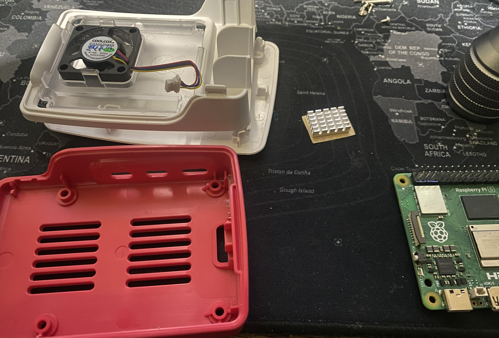
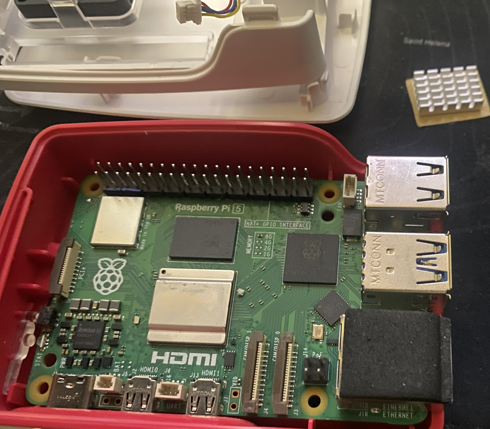
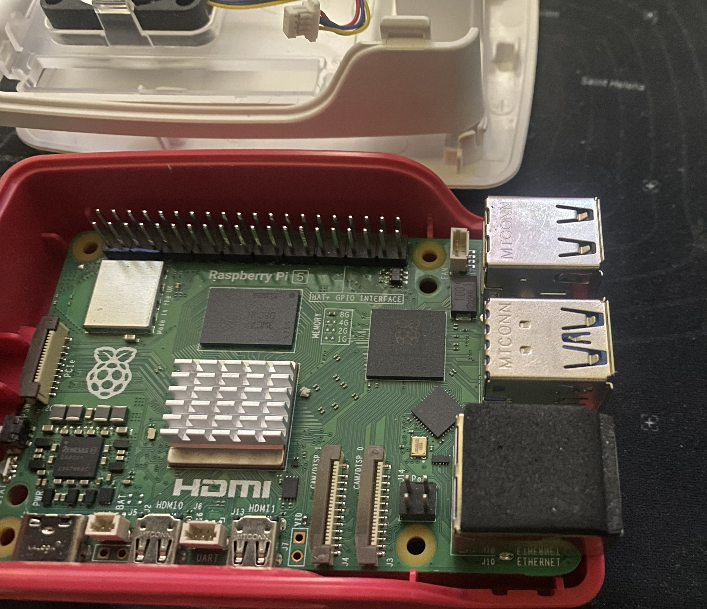
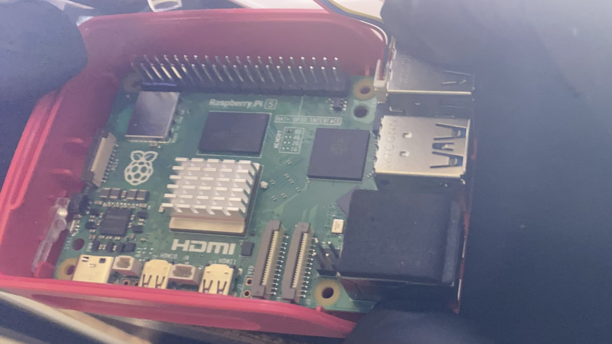
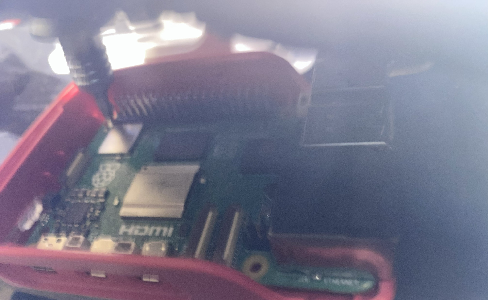
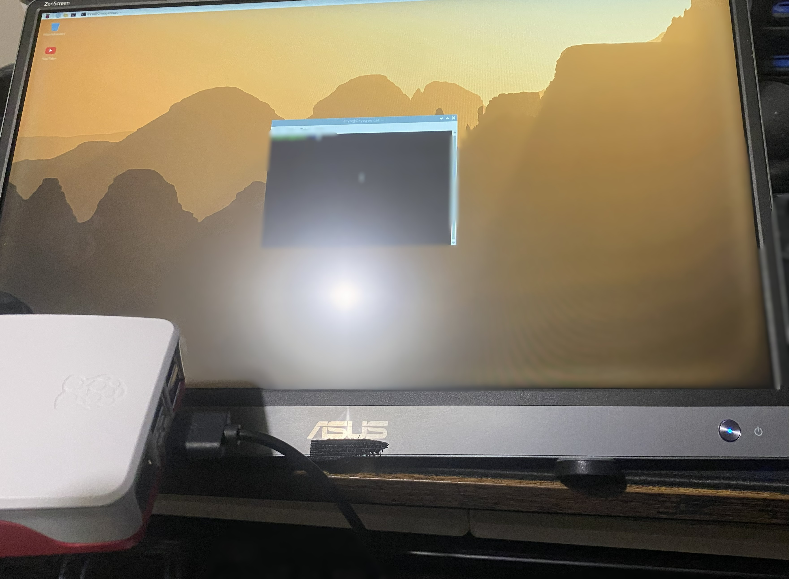

Raspberry Pi 5 – Dedicated AI Discord Bot Server
Project Overview

This project focuses on building a compact dedicated server for running AI-powered Discord bots 24/7 using a Raspberry Pi 5 with 8GB RAM. The objective is to create a low-power, always-online system capable of hosting multiple bots that handle moderation and AI interactions inside Discord servers.

Hardware Setup

The assembly process uses the official Raspberry Pi 5 case, designed with an integrated cooling solution.

Steps performed:

Install the Raspberry Pi 5 board inside the case using the four mounting screws.

Connect the case cooling fan to the dedicated fan header near the GPIO interface.

The fan wiring uses two cables: red and black, connected directly to the board’s fan connector.

Apply a small aluminum heatsink on the processor to improve heat dissipation.

Close the case after confirming that the fan and board are properly seated.

This setup ensures stable cooling while maintaining a compact form factor.

Operating System Installation

The operating system is installed using Raspberry Pi Imager.

Chosen system:

Raspberry Pi OS (Trixie)

Reasons for this choice:

lightweight system suitable for server environments

stable Python execution environment

easy SSH remote management

low hardware overhead

The OS is written to the storage device and the Raspberry Pi is booted for the first configuration.

Display Setup and Initial Access

During the initial configuration phase, a display was required to verify system boot.

Problem encountered:

the available monitor only supported USB-C video input

the Raspberry Pi does not output video through USB

Solution implemented:

connect micro-HDMI from the Raspberry Pi to an active HDMI-to-USB-C adapter

power the adapter using USB power

connect the adapter to the portable monitor

Once the display signal was established, the system could be accessed and configured.

Remote Server Configuration

After the initial setup, the system is managed remotely via SSH from a Windows machine.

Actions performed:

connect to the Raspberry Pi through SSH

transfer the Python Discord bot files developed on Windows

configure execution permissions

adjust file paths and dependencies for the Raspberry Pi environment

This allowed the server to run the bot software directly on the Pi.

Discord Bot System

Two custom Python bots were developed and deployed.

Main features include:

automated Discord channel moderation

ban, shadowban, and timeout systems

keyword filtering with externally linked word lists

AI interaction features integrated through API tokens

separation of tokens from visible source code for security

The bots were tested locally before deployment and later adapted for the server environment.

Automatic Startup Configuration

Because the server must run continuously (24/7), the system is configured so that both bots automatically start at system boot.

This ensures that:

bots restart automatically after power loss

manual intervention is not required

services remain constantly available

The configuration is completed through system startup scripts executed during boot.

Final Result

The final system functions as a compact dedicated Discord bot server.

Key outcomes:

low-power always-on server

stable Python bot execution environment

remote management via SSH

automatic service restart after reboot

ability to host multiple bots simultaneously

The project demonstrates how a Raspberry Pi 5 can be used as a small-scale infrastructure node for automation and AI-driven Discord services.
## Images

