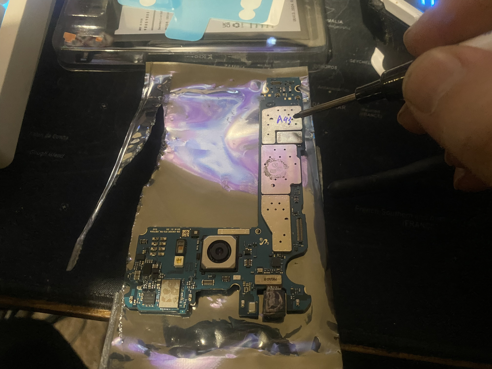
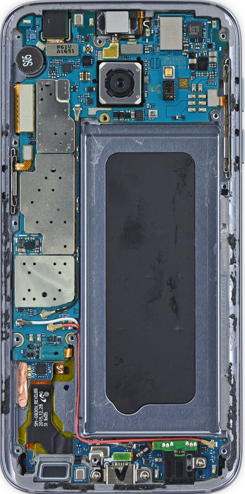
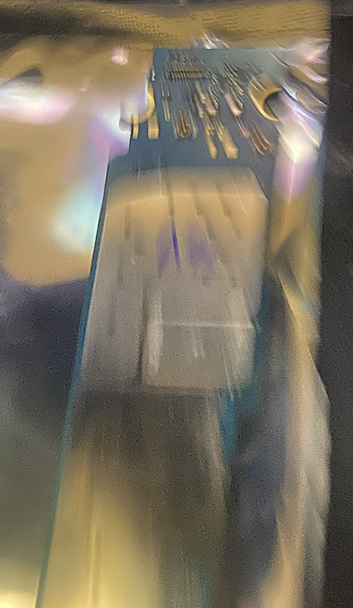
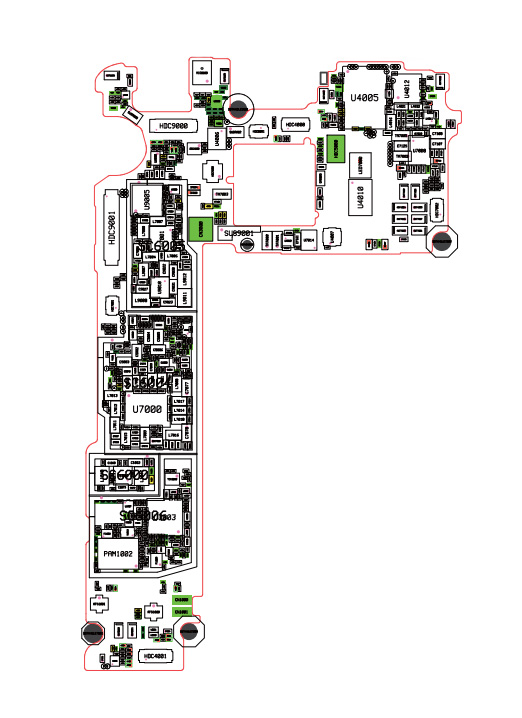
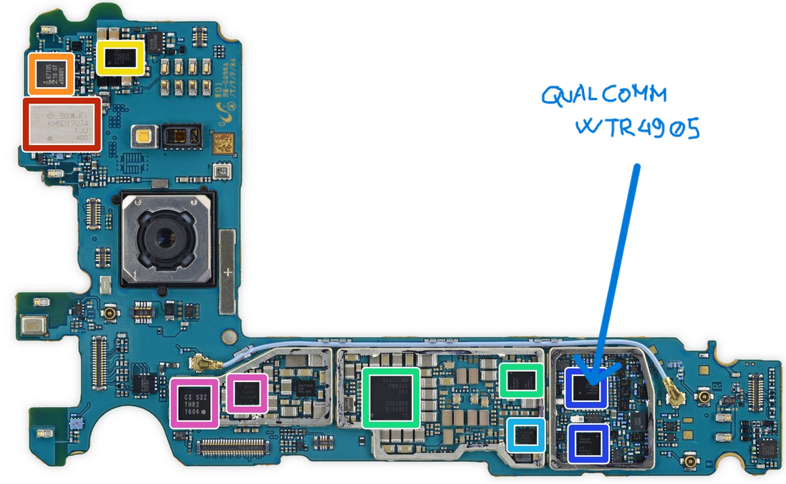
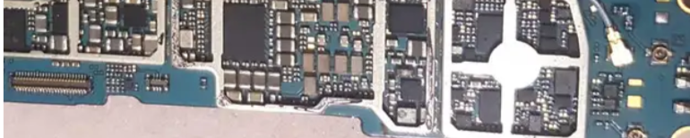
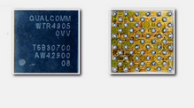

Samsung S7 Edge – RF Chip Repair (Qualcomm WTR4905)
Project Overview

This project documents the diagnosis and hardware repair of a Samsung S7 Edge experiencing severe cellular connectivity issues.

The device could connect to Wi-Fi normally but failed to properly connect to cellular networks. Calls, SMS, and mobile data were either unavailable or only partially functional.

The root cause was identified as a faulty Qualcomm WTR4905 RF transceiver chip, a component responsible for handling multiple cellular communication bands and signal processing.

Initial Diagnosis

Before opening the device, several diagnostic checks were performed:

Wi-Fi connectivity worked normally

SIM card detected but mobile network unavailable

Manual network search returned no results

SMS and voice calls failed

IMEI verified and device not blacklisted

These tests confirmed the issue was hardware-related rather than software or carrier related.

Device Disassembly

The Samsung S7 Edge requires careful disassembly due to the glass rear panel bonded with adhesive.

Steps performed:

Heat the back glass using a thermal heating plate combined with low-temperature hot air.

Insert a thin metal separation tool between the bezel and the rear glass.

Carefully remove the back cover without damaging the paint layer.

Remove the internal Phillips screws securing the protective plastic covers.

Disconnect the battery immediately for safety.

Place the battery in a fire-resistant storage bag during the repair.

With the device safely powered down, the logic board could be removed for inspection.

Fault Identification

After removing the motherboard, the RF subsystem area was inspected.

Using publicly available hardware schematics and board diagrams, the problematic component was identified as:

Qualcomm WTR4905 RF Transceiver

This chip is responsible for:

GSM / LTE band management

signal reception and transmission

radio frequency processing

cellular network communication

The component is located inside the RF shielded section near the rear camera area.

Chip Removal

To access the chip:

Remove the metal RF shielding cage.

Apply heat-resistant tape around surrounding components.

Apply flux to the chip area.

Use a hot air rework station at high temperature.

Carefully lift the chip using fine tweezers once the solder melts.

The faulty chip is then removed from the board.

PCB Cleaning and Preparation

Before installing the replacement component:

Remove residual solder using copper desoldering braid

Clean the area with flux

Apply solder paste to the pad matrix

Reflow the pads using hot air to prepare a clean solder base

This step ensures correct electrical contact for the new chip.

Chip Installation

A replacement Qualcomm WTR4905 chip was sourced online.

Installation process:

Align the chip in the same orientation as the original component

Apply flux

Heat the component with the hot air station

The BGA chip self-aligns during solder reflow

After installation:

Clean the area using isopropyl alcohol

Remove flux residues using a soft cleaning brush

Dry the board using low-temperature hot air

Reassembly

After confirming the solder joints were clean:

Reinstall the RF shielding plate

Reinsert the motherboard

Reconnect the battery

Power on the device for testing

The phone immediately detected cellular networks and was able to:

connect to mobile carriers

receive calls

send SMS

Final Assembly

Once the repair was confirmed successful:

Reinstall all internal plastic shields

Secure the screws

Reattach the rear glass panel using WD-7000 flexible adhesive

Allow the adhesive to cure

Final Result

The device returned to full cellular functionality.

Key results:

restored GSM / LTE connectivity

successful call and SMS operation

stable mobile network detection

complete hardware-level repair of RF subsystem

The repair demonstrates the process of diagnosing and replacing a BGA RF chip on a smartphone logic board, restoring full communication capability without replacing the entire motherboard.
## Image

