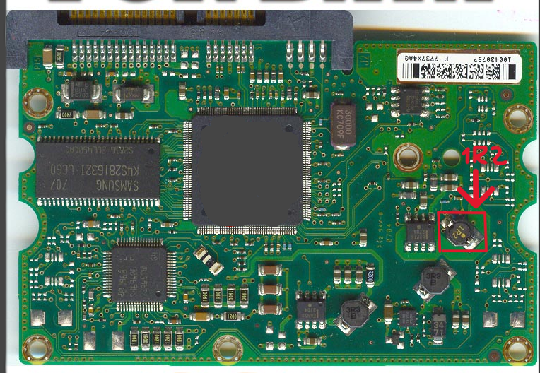
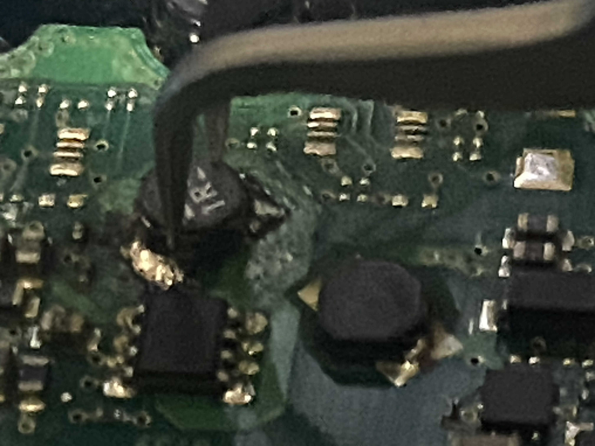
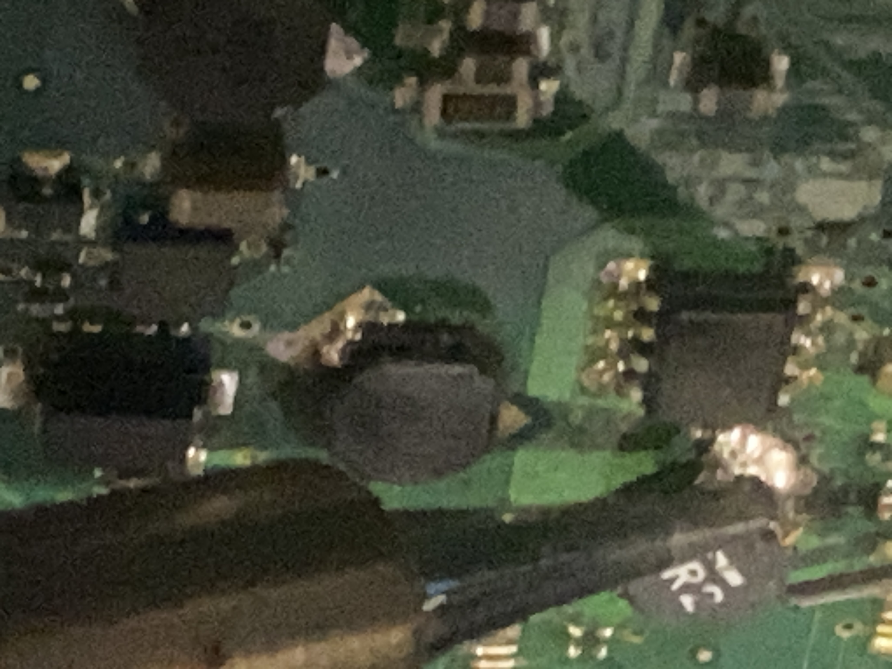
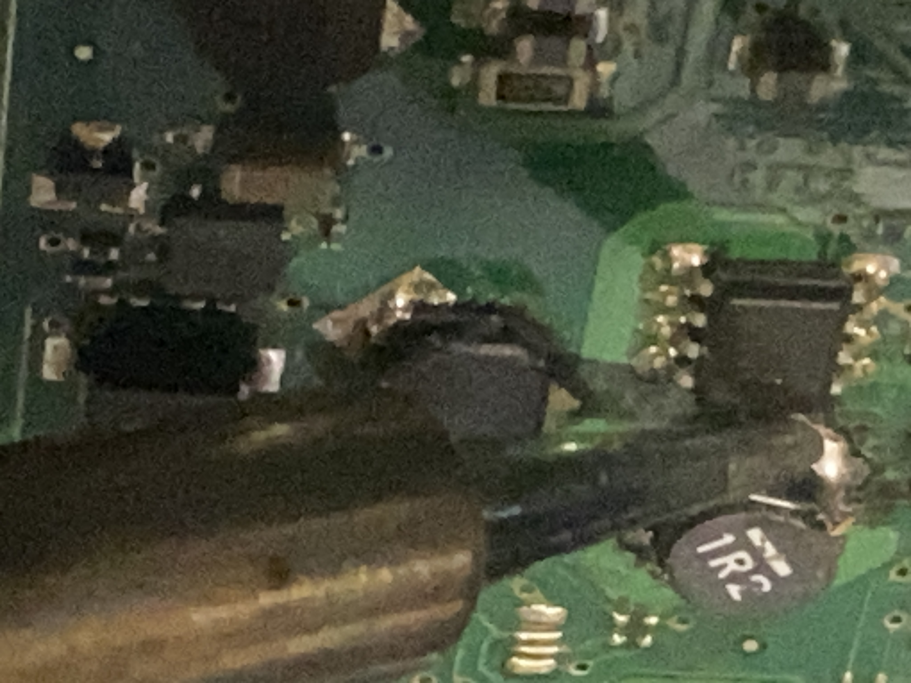
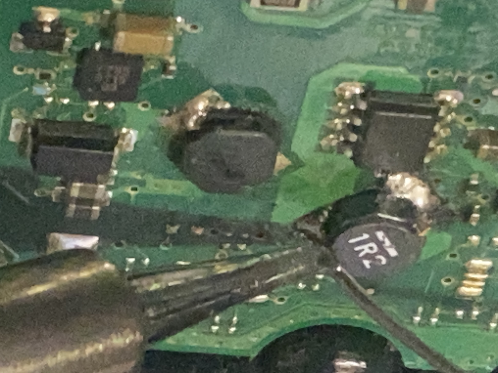
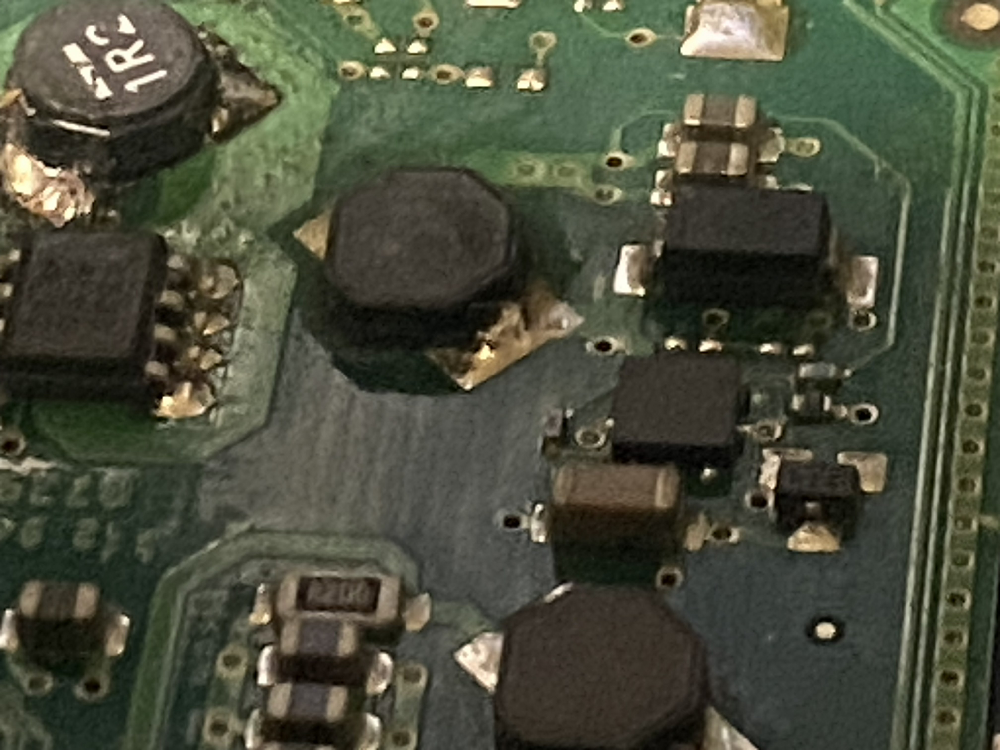
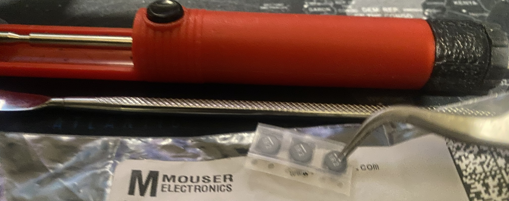

HDD PCB Repair – Seagate 500GB (1R2 Resistor Replacement)
Overview

This case documents the diagnosis and repair of a Seagate 500GB hard drive that became unreadable after hardware transfer between PC builds. The drive powered on and the platters spun normally, but the system BIOS detected the drive without allowing access to the filesystem. The operating system could see the device but could not read, format, or interact with the disk.

The root cause was traced to a missing surface-mounted component on the drive PCB.

Initial Symptoms

HDD spins normally when powered.

Audible abnormal clicking sound after spin-up.

BIOS detects the drive model.

Operating system detects the device but cannot mount or access the filesystem.

Disk utilities cannot format or recover the drive.

Initial software diagnostics included:

filesystem recovery attempts

partition inspection

recovery tools

These confirmed that the issue was not software related.

Hardware Inspection

After eliminating software causes, the drive was physically inspected.

Unlike many Seagate drives where the PCB components face inward toward the drive body, this model had components exposed outward. This increases the risk of mechanical damage during transport.

Upon visual inspection, a surface-mounted component was missing from the PCB.

Using the drive model number and PCB identifier, a reference image of the intact board was located online. Comparing both boards revealed the missing component:

SMD resistor labeled "1R2".

Component Identification

The marking 1R2 indicates a 1.2 ohm SMD resistor.

Since the component had been physically detached, the drive power regulation circuit was incomplete, preventing proper initialization of the drive electronics.

Replacement Procedure
Tools Used

soldering iron

flux

copper braid

fine tweezers

replacement SMD resistor (1R2)

Replacement components were sourced from Mouser Electronics.

Multiple resistors were purchased due to the difficulty of first-time SMD installation.

PCB Preparation

Steps performed:

Clean damaged pads using flux.

Remove old solder residue with copper braid.

Re-tin both pads with fresh solder.

Component Installation

The new resistor was placed using tweezers and soldered:

Align component on PCB pads.

Solder one side to anchor the component.

Solder the second pad.

Clean remaining flux residue.

Result

After reinstalling the PCB on the drive and reconnecting power:

The HDD initialized normally.

The clicking sound disappeared.

The system was able to access the filesystem.

All data was successfully recovered.

The repair restored full functionality of the drive.

Lessons Learned

Physical PCB inspection is critical when diagnosing storage failures.

Drives that spin but cannot be accessed may suffer from power regulation circuit damage.

Even very small SMD components can prevent full drive initialization.

Reference PCB images are extremely useful when identifying missing components.

Components Used

1R2 SMD resistor (1.2Ω)

sourced from Mouser Electronics

Skills Demonstrated

hardware fault diagnosis

PCB inspection

SMD soldering

electronic component identification

data recovery troubleshooting
## Images

